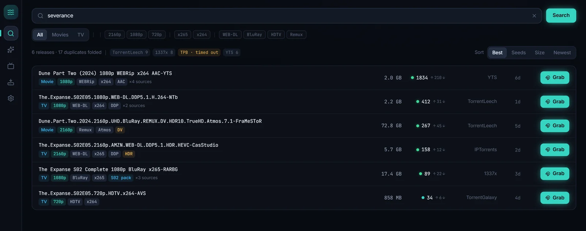
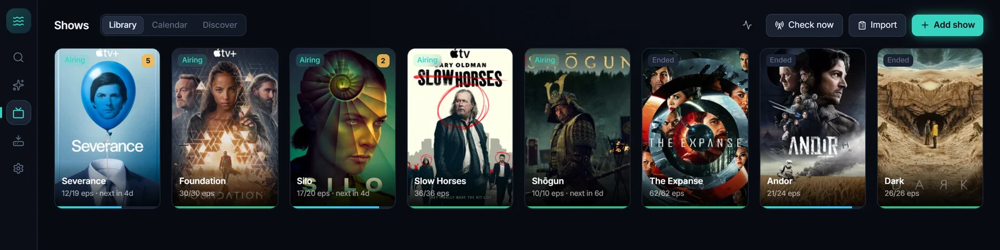
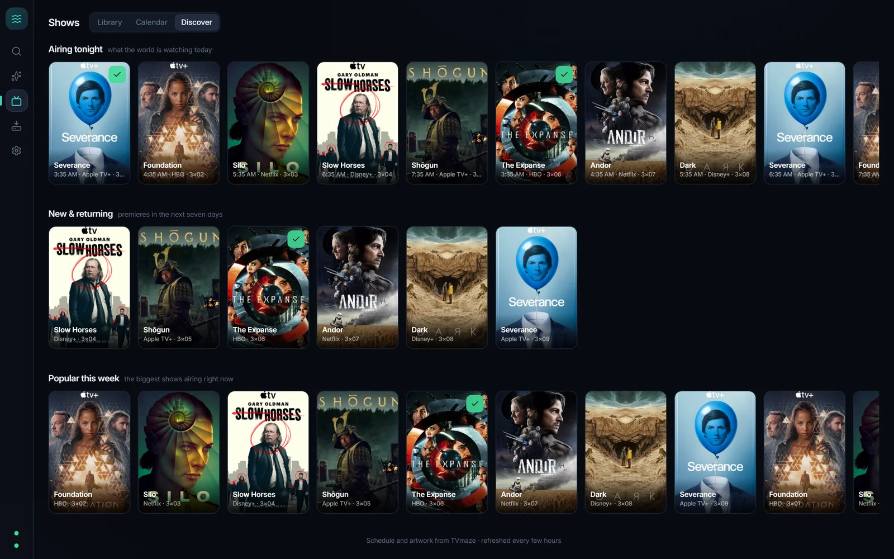
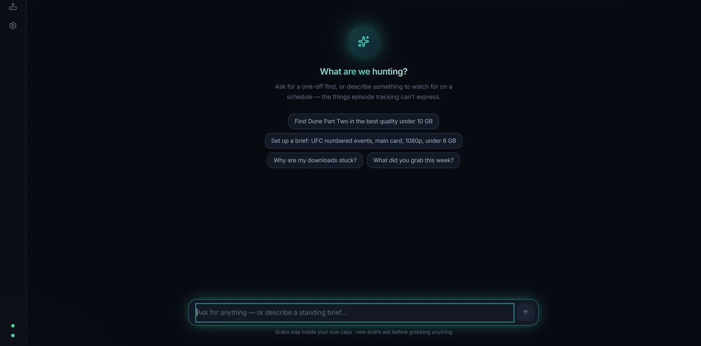
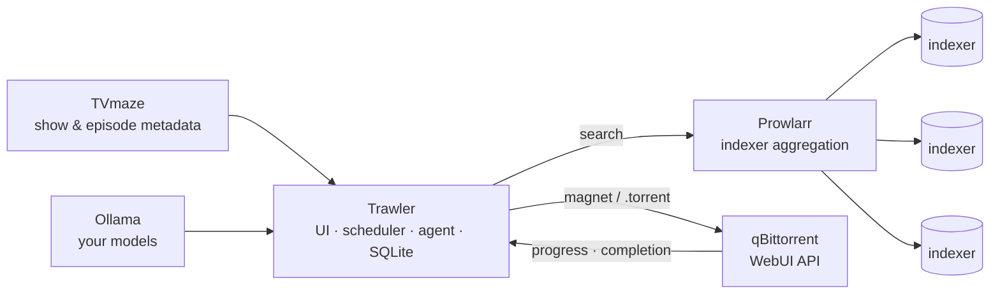

<div align="center">
  

  # Trawler

  **The media app that hunts for you.**

  Search all your torrent indexers at once. Follow shows until they end.
  Let an AI agent — running on *your* models — grab the things episode-tracking can't even name.

  
  
  
  
  

  [mediahero.org](https://mediahero.org)

</div>

---



## What it does

### 🔍 Search — every indexer, one query, no waiting
All indexers queried in parallel through [Prowlarr](https://prowlarr.com), each on its own 15-second deadline — one slow tracker never holds results hostage. Releases are deduped across indexers by content identity, scene names decoded into quality badges (resolution / source / codec / audio / HDR), junk filtered by a relevance guard, and grabbed into qBittorrent with one click.

### 📺 Follow — pick a show once, own it forever



Metadata from TVmaze (free, keyless): full episode lists, airdates, and airing status. A Rust scheduler backfills the catalog (preferring **season packs** when several episodes are missing), enforces your **quality profile** (allowed resolutions, codec preference, size caps — with one-click named presets), and goes dormant on its own when the show ends. An **RSS sweep** watches every indexer's newest uploads and grabs wanted episodes **within minutes of release** — one query per indexer per sweep, no matter how big your library grows.

### 🗓️ Calendar & Discover — see what's coming, find what's next



A month view of every followed show's schedule, color-coded by state, exportable to your real calendar as iCal. Discover surfaces what's airing tonight, premiering this week, and popular right now — click any poster for a full detail card (cast, schedule, ratings) and follow from there.

### 📋 Import — bring your watchlist with you

Paste show names, a public IMDb list URL, or IMDb's CSV export. Every line is matched on TVmaze with a confidence verdict; ambiguous names get settled by the agent (you can always override), and backfill shows an honest size estimate *before* you commit to downloading three terabytes of back catalog.

### ✨ Agent — briefs for things trackers can't name



There is no "season 2" of UFC. Describe a **standing brief** in plain language — *"UFC numbered events, main card, 1080p, under 6 GB"* — and Trawler compiles it into hard rules you confirm (the **Hunt Plan**), then hunts on your schedule using your own OpenAI-compatible endpoint (Ollama works out of the box). Finds arrive as **verdict cards** showing Rust-verified facts; approve with one click, or flip a trusted brief to auto mode. The chat drives the same machinery conversationally.

### 🩺 The quiet caretakers
- **Stalled-grab medic** — a grab whose swarm turns out to be dead gets detected, paused (never deleted), and swapped for a live release of the *same* content.
- **Upgrade scout** *(opt-in)* — once a week, looks for better-quality copies of recent downloads. Proposes only; never grabs on its own; remembers your "no".
- **Notifications** — Discord webhooks and Telegram bots for grabs, completed downloads, proposals and problems, with a rate cap so nothing ever machine-guns your phone.
- **Auto-updates** — signed releases, verified before install, delivered from a quiet card in the corner.

### The rails (all enforced in Rust, never by prompt)

| rail | guarantee |
|---|---|
| Provenance | the agent can only grab releases returned by a live search in the current run — fabricated magnets are impossible |
| Compiled constraints | every grab re-validated against the brief's confirmed Hunt Plan |
| Semantic dedupe | a shared grab ledger keyed by parsed content identity — survives REPACK/group variants, shared with the scheduler |
| Budgets | per-run search/grab/GB caps, rolling daily caps, global free-disk floor, anomaly auto-pause |
| Trust | new briefs start in propose mode; no delete tools exist at all |
| Injection defense | indexer text is fenced as untrusted data; length caps; grab-by-reference |
| Attribution | every action logged with who (chat / brief / scheduler / medic / scout) and why |

## Install

Grab the latest from **[Releases](https://github.com/mediaheros/Trawler/releases)** — Windows x64 (`-setup.exe` or `.msi`), Windows ARM64 (`arm64-setup.exe`), or Linux (`.AppImage` / `.deb` / `.rpm`). Or download from [mediahero.org](https://mediahero.org/#download).

Builds are signed for the auto-updater but not Authenticode-signed, so Windows SmartScreen may ask once (*More info → Run anyway*). The installer fetches the WebView2 runtime automatically if it's missing — that's the only dependency Trawler bundles for you. From then on, **Trawler keeps itself up to date**.

## Five-minute setup

Trawler is the brain; two free apps do the heavy lifting. The **first-run wizard** offers to install and wire up both for you — or do it by hand:

1. **[qBittorrent](https://www.qbittorrent.org/download)** — the download engine.
   After installing: *Tools → Options → Web UI* → enable **Web User Interface**, port **8080**, and tick **Bypass authentication for clients on localhost**. (If you set a username/password instead, enter them in Trawler's Settings.)
2. **[Prowlarr](https://prowlarr.com/#downloads)** — the indexer hub.
   Install and open `http://localhost:9696`, set the login it asks for, then copy the API key from *Settings → General → API Key*.
3. **Trawler** — open *Settings → Connections*, paste the Prowlarr API key, hit **Test connections** (both dots should go green), then add indexers with one click under *Settings → Indexers*.
4. *(Optional, for the agent)* **[Ollama](https://ollama.com)** anywhere on your network with at least one tool-calling model (`kimi-k2.6:cloud`, `deepseek-v4-flash:cloud`, and local `qwen3` variants all verified). Point *Settings → Agent* at it.

That's the whole stack. Follow a show, write a brief, and let it hunt.

## How it fits together



Trawler deliberately owns **none** of the fragile parts: indexer definitions live in Prowlarr (community-maintained), metadata comes from TVmaze, models are yours, downloading is qBittorrent's job. Trawler is the brain and the face.

## Stack

- **Shell** — [Tauri 2](https://tauri.app): ~10 MB binary over WebView2, tray-resident, toasts, autostart, signed auto-updates
- **Backend** — Rust: `reqwest` clients (Prowlarr / qBittorrent / TVmaze / OpenAI-compatible LLMs), scene-name parser, ranking & dedupe, `rusqlite` persistence, `tokio` schedulers, the agent tool-loop with hard budget rails
- **Frontend** — React 19 + TypeScript + Tailwind v4 + zustand, hand-rolled component kit, Inter + JetBrains Mono

## Development

Prereqs: [Prowlarr](https://prowlarr.com) on `:9696`, [qBittorrent](https://www.qbittorrent.org) WebUI on `:8080`, Node 24+, Rust (MSVC). Optional: an Ollama endpoint for the agent.

```bash
npm install
npm run dev           # UI only, in a browser, with mock data — no services needed
npm run tauri dev     # full dev app with hot reload
npm run tauri build   # production build + installers
cd src-tauri && cargo test   # parser, matcher, scheduler-pick and rail tests
```

Config: `%APPDATA%\trawler\config.json` · State: `%APPDATA%\trawler\trawler.db` · Everything configurable in-app under Settings.

The landing site lives in [`docs/`](docs/) and deploys to [mediahero.org](https://mediahero.org) via Cloudflare Pages. `scripts/shoot.mjs` regenerates every screenshot from the mock UI.

## Credits

Standing on the shoulders of [Prowlarr](https://github.com/Prowlarr/Prowlarr), [TVmaze](https://www.tvmaze.com/api), [qBittorrent](https://github.com/qbittorrent/qBittorrent), and [Ollama](https://ollama.com).

---

<div align="center">
  <sub>© Hero Media Systems · <a href="LICENSE">MIT licensed</a> — free, open source, built with love · <a href="https://mediahero.org">mediahero.org</a></sub>
</div>
